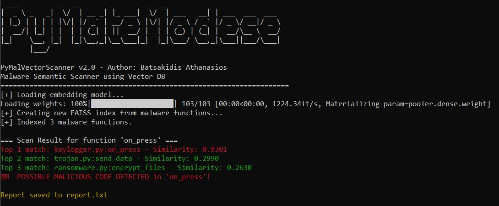

# PyMalVectorScanner

**PyMalVectorScanner** is a Python-based semantic malware scanner that uses vector embeddings to detect malicious code at the function level. It leverages **Sentence Transformers** for embedding Python code and **FAISS** for efficient similarity search.

---

## Features

- Function-level malware scanning.
- Semantic detection using vector embeddings.
- Top-K most similar malware functions are shown.
- Color-coded terminal output for quick identification:
  - ✅ Safe functions (green)
  - ⚠️ Suspicious functions (red)
- CLI support with optional parameters:
  - `--only-suspicious / -s` → show only suspicious functions.
  - `--report <file> / -r <file>` → save a report file with detected suspicious functions.
  - `--help / -h` → display help and usage instructions.
- FAISS index caching for faster repeated scans.
- Works with multiple Python malware samples in `malware_samples/`.

---

## Installation

1. Clone this repository or download the files.
2. Install the required dependencies:

```bash
pip install faiss-cpu sentence-transformers numpy colorama pynput requests
```

> ⚠️ **Note:** Some sample malware functions use `pynput` and `requests` for demonstration purposes.

---

## Setup

1. Place your known malware Python scripts in the `malware_samples/` folder.
2. The scanner will automatically create a FAISS index on first run (`malware.index`) and store function names (`malware_functions.pkl`).

---

## Usage

### Basic scan

```bash
python scanner.py test_file.py
```

Displays all functions in the target file with similarity scores.

### Show only suspicious functions

```bash
python scanner.py test_file.py -s
```

### Save a suspicious functions report

```bash
python scanner.py test_file.py -s -r report.txt
```

### Help

```bash
python scanner.py -h
python scanner.py --help
```

---

## Example

**Target file (`test_file.py`):**

```python
def on_press(key):
    with open("keys.log", "a") as f:
        f.write(str(key))
```

Command:
```bash
python scanner.py test_file.py -s -r report.txt
```

Output:
=== Scan Result for function 'on_press' ===
Top 1 match: keylogger.py:on_press - Similarity: 0.9301
⚠️  POSSIBLE MALICIOUS CODE DETECTED in 'on_press'!

Report saved to report.txt

report.txt:

Suspicious Functions Report
==================================================
on_press: 0.9301 -> keylogger.py:on_press

Requirements
- Python 3.8+

- Packages:
	- faiss-cpu
	- sentence-transformers
	- numpy
	- colorama
	- pynput (optional, for sample keylogger)
	- requests (optional, for sample trojan)

## Screenshot



## License

MIT License © 2026 Athanasios Batsakidis


## Author

Athanasios Batsakidis
PyMalVectorScanner v2.0